# **Dynamic Braking of DC Machine using Variable Resistors**

## **Project Description**
- This Project demonstrates **Dynamic Braking** in a DC Motor using **Variable Resistors**. During Braking, the Motor acts as a Generator, Converting Kinetic Energy into Electrical Energy, which is dissipated as Heat in Resistors. 

- By Varying Resistance, Braking Torque and Deceleration Rate are Controlled for Smooth Stopping. This Principle is crucial in **Industrial Drives and Traction Systems** requiring Controlled and Reliable Braking Performance.

---

## **Project Objective**
- To Analyze Dynamic Braking in DC Machines, Understand Resistance Control Effects, and Observe Relationships among **Braking Torque**, **Current**, and **Speed**.  
- The Goal is to Verify that Variable Resistors enable Controllable Deceleration by Regulating Armature Current and Torque during Braking.  
- The Experiment emphasizes Understanding the Transition from **Motoring** to **Generating** Mode in DC Machines under Braking Conditions.  

---

## **Working Principle**

```mermaid
flowchart TD
    A([Motor Operating]) --> B{Operating Mode}
    B -->|Motoring| C[Power Supply Connected]
    C --> D[Armature Receives Current]
    D --> E[Motor Produces Torque and Speed]
    E --> F[Normal Operation]

    B -->|Braking| G[Supply Disconnected]
    G --> H[Armature Connected to Braking Resistor]
    H --> I[Motor Acts as Generator]
    I --> J[Induced EMF Causes Current Through Resistor]
    J --> K[Counter Torque Produced]
    K --> L[Speed Gradually Decreases]
    L --> M[Motor Stops Smoothly]

    style A fill:#700404,stroke:#036,stroke-width:2px
    style B fill:#000000,stroke:#d96,stroke-width:2px
    style C fill:#6b6202,stroke:#036,stroke-width:2px
    style D fill:#6b6202,stroke:#036,stroke-width:2px
    style E fill:#6b6202,stroke:#036,stroke-width:2px
    style G fill:#6b6202,stroke:#036,stroke-width:2px
    style F fill:#6b6202,stroke:#036,stroke-width:2px
    style I fill:#6b6202,stroke:#036,stroke-width:2px
    style H fill:#6b6202,stroke:#036,stroke-width:2px
    style J fill:#6b6202,stroke:#036,stroke-width:2px
    style K fill:#6b6202,stroke:#036,stroke-width:2px
    style L fill:#6b6202,stroke:#036,stroke-width:2px
    style M fill:#6b6202,stroke:#036,stroke-width:2px
```

---

## **Model Description**

```mermaid
flowchart TD
    A([DC Power Source]) --> B{Operating Condition?}
    B -->|Motoring| C[Switches S, S1, S2, S3 Closed]
    C --> D[Armature Connected to Supply]
    D --> E[DC Machine Converts Electrical to Mechanical Energy]
    E --> F[Motor Delivers Torque and Runs at Rated Speed]

    B -->|Braking| G[Supply Disconnected]
    G --> H[Armature Connected to Variable Resistors R1, R2, R3]
    H --> I[Motor Acts as Generator]
    I --> J[Generated Energy Dissipated as Heat in Resistors]
    J --> K[Speed Decreases with Controlled Braking Torque]

    style A fill:#700404,stroke:#036,stroke-width:2px
    style B fill:#000000,stroke:#d96,stroke-width:2px
    style C fill:#6b6202,stroke:#036,stroke-width:2px
    style D fill:#6b6202,stroke:#036,stroke-width:2px
    style E fill:#6b6202,stroke:#036,stroke-width:2px
    style G fill:#6b6202,stroke:#036,stroke-width:2px
    style F fill:#6b6202,stroke:#036,stroke-width:2px
    style I fill:#6b6202,stroke:#036,stroke-width:2px
    style H fill:#6b6202,stroke:#036,stroke-width:2px
    style J fill:#6b6202,stroke:#036,stroke-width:2px
    style K fill:#6b6202,stroke:#036,stroke-width:2px
```

---

## **Simulink Model**

---

## **Graphical Results**

---

## **Observations and Results**

* Reducing Resistance Increases **Braking Torque** and **Armature Current**, resulting in **Faster Deceleration**.
* Increasing Resistance Reduces Torque and Slows Down Braking.
* The **Torque-Current Relationship** verifies Energy Conversion during Braking.
* The observed **Speed**, **Current**, and **Torque** profiles Match Theoretical Expectations.

---

## **Expected Output**

The Simulation should Show:

* Motor Speed gradually Decreasing to **Zero**.
* Corresponding **Negative Torque** and **Reverse Armature Current** during Braking.
* **Field Current** remains Constant, confirming Generator-Mode Operation with Resistive Dissipation.

---

## **Conclusion**

- Dynamic Braking using Variable Resistors provides **Controlled Deceleration** of a DC Motor.
- By Adjusting Resistance, Braking Torque and Stopping Rate are Effectively Tuned.
- The System validates the **Energy Conversion** from Mechanical to Electrical Form and its Dissipation, Proving its Value in **Industrial and Traction Applications**.

---

## **Contributors**
1. Aayush Anil Mishra - Dept. of Mechatronics (Simulink Model and Calculations)
2. Manas Tewari - Dept. of Mechatronics (Project Report)
3. Mrinal Kumar - Dept. of Mechatronics (Ideation and Repository Management)
4. Dhruv Mehta - Dept. of Mechatronics (Presentation and Conceptualization)
---

